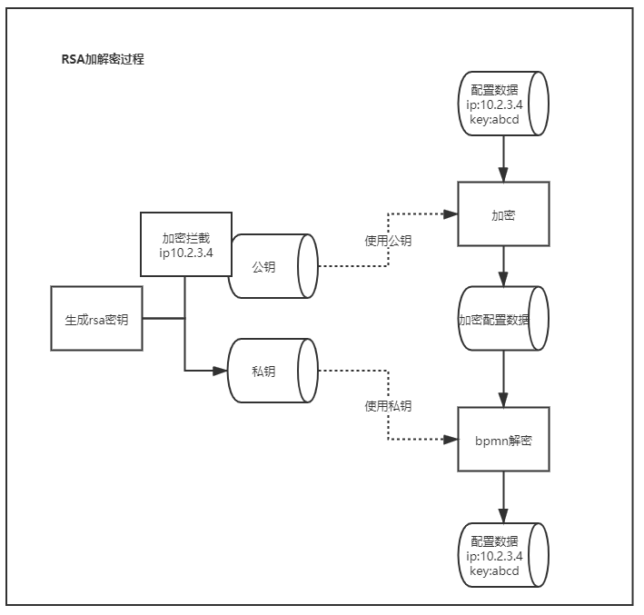
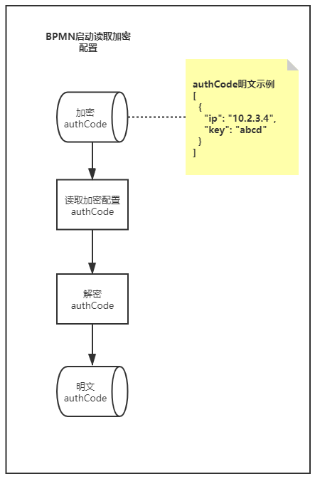
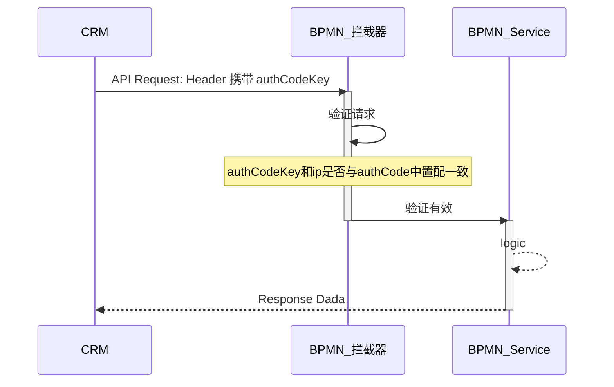

# BPMN 服务授权实现方案

## 前言：RAS加解密流程

测试工具[在线rsa加解密](https://www.bejson.com/enc/rsa/)

## bpmn启动流程

说明：bpmn内置**私钥**，用于解密

## 拦截验证逻辑时序

```mermaid
sequenceDiagram
    CRM->>BPMN_拦截器: API Request: Header 携带 authCodeKey
    activate BPMN_拦截器
    BPMN_拦截器->>BPMN_拦截器: 验证请求 
    Note over BPMN_拦截器: authCodeKey和ip是否与authCode中置配一致
    BPMN_拦截器->>BPMN_Service: 验证有效
    deactivate BPMN_拦截器
    activate BPMN_Service
    BPMN_Service-->>BPMN_Service: logic
    BPMN_Service-->>CRM: Response Dada
    deactivate BPMN_Service
```